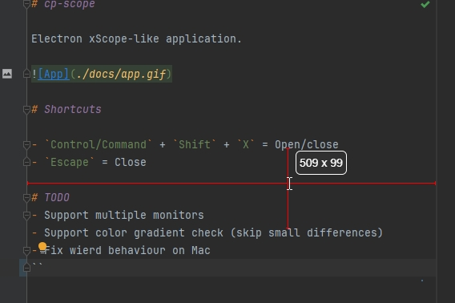

# cp-scope

Electron xScope-like application. It measures pixel distance between objects in any application.

# Shortcuts

- `Control/Command` + `Shift` + `X` = Open/close
- `Escape` = Close

# TODO

- Support multiple monitors
- Support color gradient check (skip small differences)
- Fix wierd behaviour on Mac
